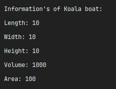
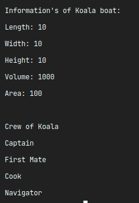
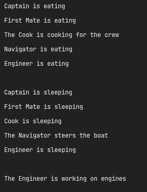

# Accompagnement PHP

Un accompagnement sur les classes en PHP et l'utilisation de plusieurs fichier

## Etape 1:
Créer les fichiers index.php et bateau.php.

## Etape 2:
Dans le fichier bateau.php, implémenter la classe Bateau suivante:

```php
Class Bateau 
{
    private $nom = '';
    private $longueur = 0;
    private $hauteur = 0;
    private $largeur = 0;

    public function __construct($nom, $longeur, $largeur, $hauter)
    {
        /*
        *   partie à implémenter
        */
    }

    public function obtenirNom() 
    {
        return $this->nom;
    }

    public function fixerNom($nouveauNom) 
    {
        $this->nom = $nouveauNom;
    }

    //implémenter les autres 'Getter' et 'Setter'
}
```
### Etape 3:
Dans la class Bateau, implémenter la nouvelle méthode 'afficherInfoBateau' qui affiche dans le terminal les informations du bateau.

```php
Class Bateau 
{
    public function afficherInfoBateau() 
    {
        /*
        *   partie à implémenter
        */
    }
}
```
### Etape 4:
Créer dans index.php une instance de la classe Bateau et afficher ses informations.

```php
include_once "bateau.php"
```

Une possibilité d'affichage:
<div align="center"></div>

### Etape 5:
Créer un fichier equipage.php et implémenter la classe Equipage suivante:

```php
include_once "bateau.php"

class Equipage extends Bateau
{
    private $equipage = array();

    public function __construct($nom, $longeur, $largeur, $hauteur,         $equipage)
    {
        parent::__construct($nom, $longeurn $largeur, $hauteur);
        $this->equipage = $equipage;
    }

    public function afficherInfoEquipage()
    {
        /*
        *   à implémenter :
        *   affiche sur le terminal les informations de l'équipage 
        *   ainsi que celle du Bateau
        */
    }

    //implémenter le 'Getter' et le 'Setter' d'Equipage
}
```
### Etape 6:
Dans le fichier index.php, créer une instance de la classe Equipage et afficher ses informations.

```php
include_once "equipage.php"
```
Une possibilité d'affichage:
<div align="center"></div>

### Etpae 7:
Créer le fichier travail.php, dans celui-ci créer l'interface Travail

```php
interface Travail
{
    public function travail($crew);
}
```

### Etape 8:
Créer les classes Cuisine, Navigation et Moteur toutes impémentant l'interface Travail.

```php
class Cuisine implements Travail 
{

    public function travail($equipage) {
        foreach($equipage->obtenirEquipage() as $membre) {
            if ($membre == "Cuisinier") {
                echo "Le Cuisinier cuisine pour l'équipage.\n";
            } else {
                echo $membre . " mange.\n"
            }
        }
    }
}

//implémenter de manière similaire les classes Navigation et Moteur
```
### Etape 9:
Implémenter dans la classe Equipage la nouvelle méthode "travail".

```php
public function travail($travail) {
    $travail->travail($this);
}
```

### Etape 10:
Dans index.php, créer les instances de Cuisine, Navigation et Moteur puis appeler la méthode travail d'instance d'Equipage pour chaque travail.

```php
include_once "travail.php"

$cuisine = new Cuisine();

$monEquipage->travail($cuisine);

//à faire pour chaque instance de travail
```
Une possibilité d'affichage:
<div align="center"></div>
